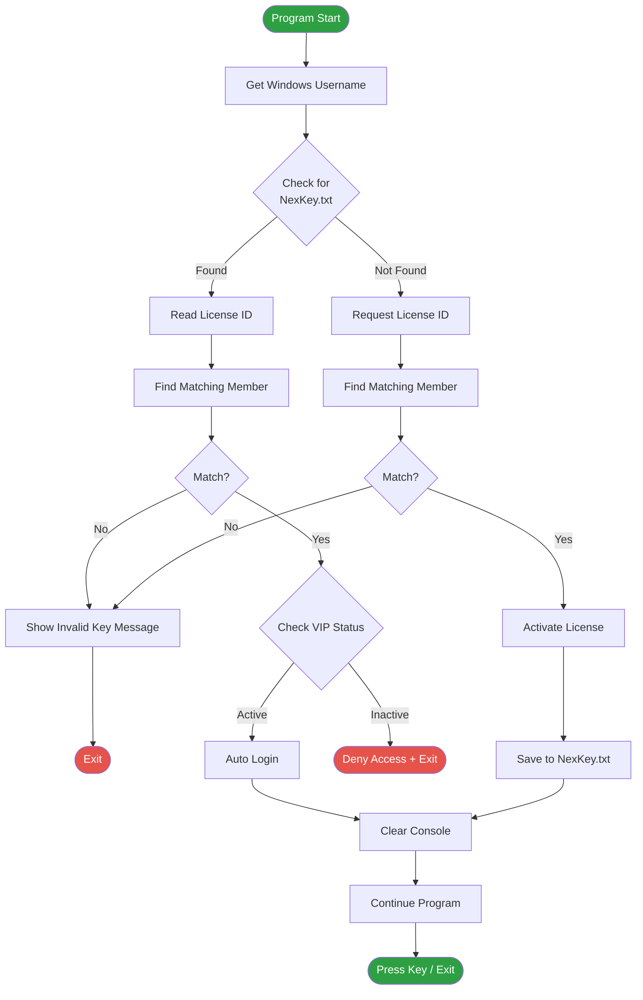
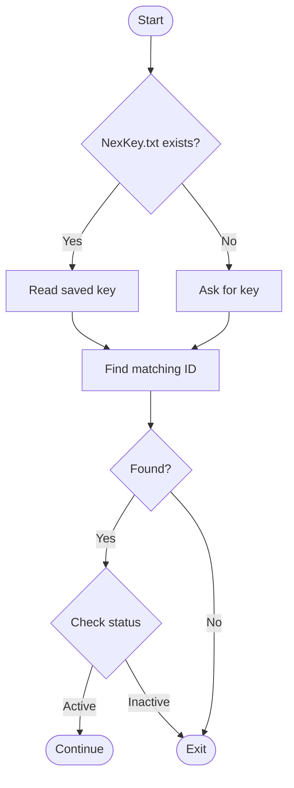

<p align="center">
  
  
  
</p>

<h1 align="center">NexOP</h1>

<p align="center">
  A lightweight Windows console application written in C++ that provides a simple license-key and account activation system.
</p>

---

## Overview

The application identifies the current Windows user, checks for a previously saved license in `NexKey.txt`, validates the license against a list of active members, and provides either automatic login or first-time license activation.

| | |
|---|---|
| **Platform** | Windows |
| **Language** | C++ |
| **Application type** | Console application |

## Features

- 🖥️ Windows username detection
- 🔑 License-key validation
- 💾 Local license persistence using `NexKey.txt`
- 👤 Automatic login for returning users
- ⭐ VIP/active account status checking
- 🚫 Deactivated/banned account handling
- ⏱️ Console loading delays for status messages
- 🪟 Windows console support

## How It Works

When the application starts, it attempts to retrieve the username of the currently logged-in Windows user, then checks whether a local `NexKey.txt` file exists.

### Existing license

If `NexKey.txt` exists:

1. The application reads the stored license ID.
2. The license is compared against the `ActiveMembers` list.
3. If a matching account is found, its status is checked.
4. Active accounts are automatically signed in.
5. Deactivated/banned accounts are denied access.

### New license

If `NexKey.txt` does not exist:

1. The user is prompted to enter a license.
2. The license is compared against the available member IDs.
3. If a matching license is found, its status is checked.
4. A newly activated license is written to `NexKey.txt`.
5. On subsequent launches, the application can use the saved license for automatic login.

## Program Flow



### Current authentication logic (simplified)



## Member Database

The application currently contains a hard-coded member list:

```cpp
ActiveMembers members[] = {
    {39475924, true},
    {43262354, false},
};
```

Each member contains:

| Field | Type | Description |
|---|---|---|
| `id` | `int` | License/account identifier |
| `vip` | `bool` | Whether the account is active |

For example, `{39475924, true}` represents an active account, while `{43262354, false}` represents an inactive/deactivated account.

## Local License File

The application uses `NexKey.txt` to store the license associated with the local installation.

**Example contents:**
```
39475924
```

On startup, the application attempts to open this file:

```cpp
ifstream FileName("NexKey.txt");
```

If the file can be opened, the stored ID is read and checked against the member list. When a new license is activated, the application creates/overwrites the file:

```cpp
ofstream filename("NexKey.txt");
filename << KeyLicense;
filename.close();
```

## Dependencies

The program uses several Windows/C++ headers:

```cpp
#include <iostream>
#include <windows.h>
#include <conio.h>
#include <fstream>
#include <string>
#include <thread>
#include <chrono>
```

| Header | Purpose |
|---|---|
| Windows API | Retrieving the current Windows username |
| `<iostream>` | Console input/output |
| `<fstream>` | Reading and writing `NexKey.txt` |
| `<thread>` / `<chrono>` | Timed delays |
| `<conio.h>` | Windows console functionality |

> Because the program includes `windows.h`, it is currently intended for Windows, rather than Linux or macOS.

## Building

Using a Windows C++ compiler such as MinGW or MSVC, compile the source as a Windows console application.

For example, with MinGW:

```bash
g++ main.cpp -o NexOP.exe
```

Then run:

```bash
NexOP.exe
```

> Make sure `NexKey.txt` is located in the application's working directory if an existing license should be detected.

## Important Implementation Notes

### 1. VIP status is not actually persisted

This code:

```cpp
for (ActiveMembers members : members) {
    ...
    members.vip = true;
}
```

iterates over **copies** of the array elements. Therefore `members.vip = true;` does not modify the original `ActiveMembers` array.

If the intention is to modify the actual member, the loop should use a reference:

```cpp
for (ActiveMembers& member : members) {
    ...
    member.vip = true;
}
```

However, even with this change, the status would only exist for the current execution unless it is saved somewhere persistent.

### 2. The license system is local and hard-coded

All valid IDs are compiled directly into the executable:

```cpp
ActiveMembers members[] = {
    {39475924, true},
    {43262354, false},
};
```

This means adding or removing licenses requires modifying and rebuilding the program. For a production application, a server-side licensing system would generally be more appropriate.

### 3. NexKey.txt can be modified manually

Because the license is stored as plain text, a user can potentially open and modify the file. For anything requiring strong license protection, local plaintext storage should not be considered secure.

### 4. License IDs should use a suitable type

The current implementation uses `int id;`. For larger license identifiers, `std::int64_t` or a string-based license format may be preferable.

## Project Structure

```
NexOP/
│
├── main.cpp
├── NexOP.exe
├── NexKey.txt
└── README.md
```

`NexKey.txt` is generated when a new license is successfully activated.

## Future Improvements

- [ ] Replace hard-coded licenses with a database
- [ ] Store license information securely
- [ ] Add proper account registration
- [ ] Add an expiration date to licenses
- [ ] Add license revocation support
- [ ] Persist account activation status
- [ ] Add error handling for corrupted `NexKey.txt` files
- [ ] Validate user input before processing it
- [ ] Replace `system("cls")` with a safer console-clearing implementation
- [ ] Remove unused headers and variables
- [ ] Separate authentication logic into functions/classes
- [ ] Add a proper logging system
- [ ] Use a remote authentication server for licenses that need to be centrally managed

## Disclaimer

This project is provided for educational and development purposes. The current implementation is a basic local authentication/license mechanism and should not be considered a secure production licensing system.

## License

Add your preferred project license here, such as MIT, GPL-3.0, or a proprietary license.

---

<p align="center"><sub>Copyright © 2026 Nexa</sub></p>
