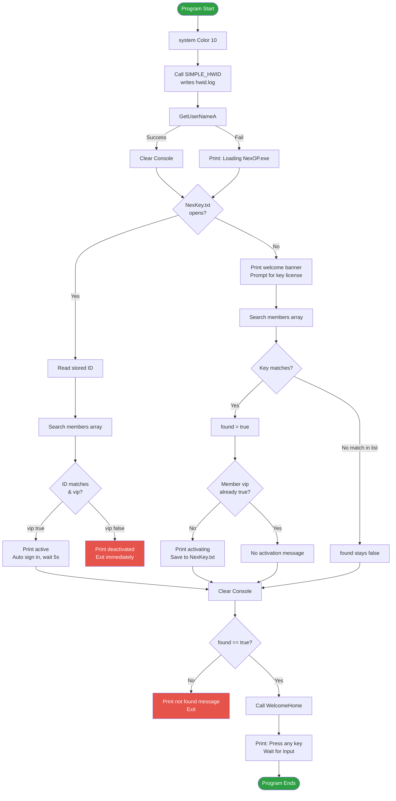
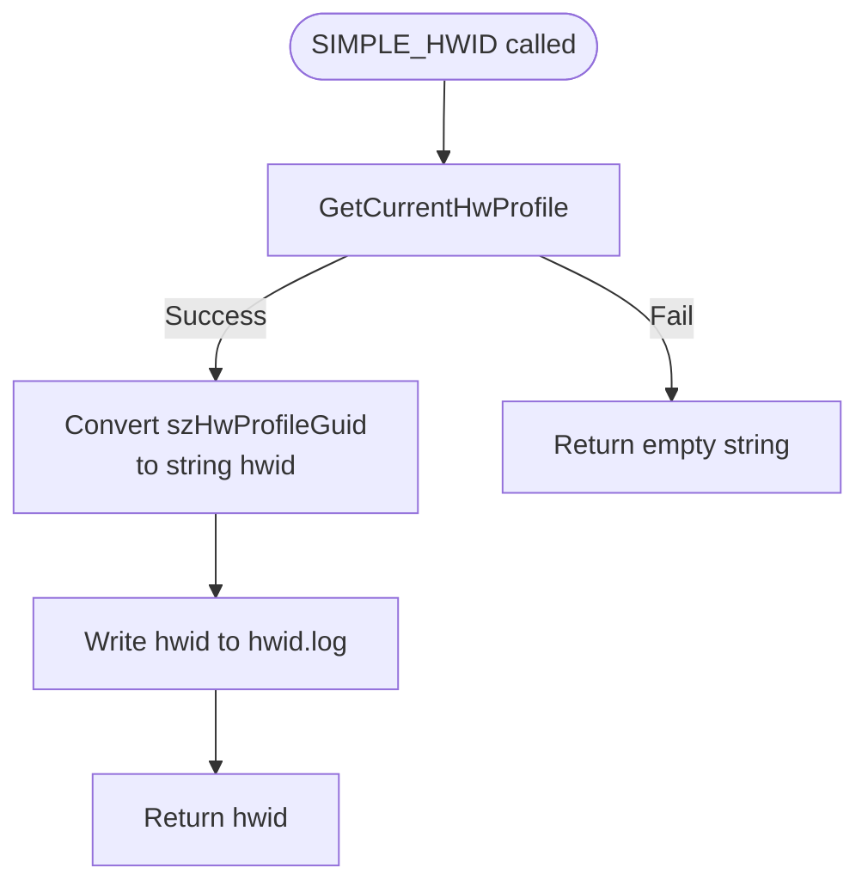

<p align="center">
  
  
  
</p>

<h1 align="center">NexOP</h1>

<p align="center">
  A lightweight Windows console application written in C++ that provides a simple license-key and account activation system, with a basic hardware ID grabber.
</p>

---

## Overview

The application sets the console color, grabs a hardware profile ID via `SIMPLE_HWID()`, retrieves the current Windows username, checks for a previously saved license in `NexKey.txt`, validates the license against a hard-coded member list, and either auto-signs the user in or walks them through first-time key activation.

| | |
|---|---|
| **Platform** | Windows |
| **Language** | C++ |
| **Application type** | Console application |

## Features

- 🎨 Sets console color on startup (`Color 10`)
- 🆔 Grabs a hardware profile GUID via `SIMPLE_HWID()` and logs it to `hwid.log`
- 🖥️ Windows username detection (`GetUserNameA`)
- 🔑 License-key validation against a hard-coded member list
- 💾 Local license persistence using `NexKey.txt`
- 👤 Automatic login for returning users
- ⭐ VIP/active account status checking
- 🚫 Deactivated/banned account handling
- ⏱️ Console loading delays for status messages
- 👋 Closing message via `WelcomeHome()`

## How It Works

### 1. Startup

`main()` sets the console color, then immediately calls `SIMPLE_HWID()`. This function reads the current hardware profile via `GetCurrentHwProfile`, converts the profile GUID into a `string`, writes it to `hwid.log`, and returns it — though in the current code, that returned value is discarded at the call site (see [Implementation Notes](#important-implementation-notes)).

### 2. Existing license

If `NexKey.txt` exists and can be opened:

1. The stored ID is read from the file.
2. The console is welcomed back with the detected Windows username.
3. The `members[]` array is searched for a matching `id`.
4. If found and `vip == true`, the app prints an active-account message and auto-signs in.
5. If found and `vip == false`, the app prints a deactivated/banned message and exits immediately.

### 3. New license

If `NexKey.txt` does not exist (or can't be opened):

1. A welcome banner is printed and the user is prompted to enter a key license.
2. The `members[]` array is searched for a matching `id`.
3. If found, `found` is set to `true`.
4. If that member's `vip` was `false`, an activation message prints and the key is written to `NexKey.txt` for future auto-login. *(Note: with the current member list both entries are already `true` — see notes below.)*

### 4. Wrap-up

The console clears. If no match was ever found, an error message prints and the program exits. Otherwise, `WelcomeHome()` runs a short thank-you message, and the program waits for a keypress before closing.

## Program Flow



### SIMPLE_HWID() flow



> Note: `main()` currently calls `SIMPLE_HWID();` without capturing the return value — the GUID only persists via the `hwid.log` file write, not as an in-memory value usable elsewhere in `main()`.

## Member Database

The application currently contains a hard-coded member list:

```cpp
ActiveMembers members[] = {
    {39475924, true},
    {43262354, true},
};
```

Each member contains:

| Field | Type | Description |
|---|---|---|
| `id` | `int` | License/account identifier |
| `vip` | `bool` | Whether the account is active |

> Both entries are currently marked `true` (active). If you want to test the "deactivated account" path or the "first-time activation" path, you'll need at least one entry set to `false`.

## Local License File

The application uses `NexKey.txt` to store the license associated with the local installation.

**Example contents:**
```
39475924
```

On startup, the application attempts to open this file:

```cpp
ifstream FileName("NexKey.txt");
```

If the file can be opened, the stored ID is read and checked against the member list. When a new license is activated, the application creates/overwrites the file:

```cpp
ofstream filename("NexKey.txt");
filename << KeyLicense;
filename.close();
```

## Hardware ID Log

`SIMPLE_HWID()` writes the detected hardware profile GUID to `hwid.log` in the working directory every time the program runs:

```cpp
ofstream newfile("hwid.log");
newfile << hwid;
newfile.close();
```

## Dependencies

```cpp
#define _WIN32_WINNT 0x0400
#include <stdio.h>
#include <iostream>
#include <windows.h>
#include <conio.h>
#include <fstream>
#include <string>
#include <thread>
#include <chrono>
#include <stdlib.h>
```

| Header | Purpose |
|---|---|
| Windows API (`windows.h`) | `GetCurrentHwProfile`, `GetUserNameA` |
| `<iostream>` | Console input/output |
| `<fstream>` | Reading/writing `NexKey.txt` and `hwid.log` |
| `<thread>` / `<chrono>` | Timed delays (`this_thread::sleep_for`) |
| `<conio.h>` | Windows console functionality |
| `<stdlib.h>` | `system()`, `exit()` |

> Because the program includes `windows.h`, it is intended for Windows, rather than Linux or macOS.

## Building

Using a Windows C++ compiler such as MinGW or MSVC, compile the source as a Windows console application.

For example, with MinGW:

```bash
g++ main.cpp -o NexOP.exe
```

Then run:

```bash
NexOP.exe
```

> Make sure `NexKey.txt` is located in the application's working directory if an existing license should be detected.

## Important Implementation Notes

### 1. Leftover project name in the welcome banner

The "new license" path still prints:

```cpp
cout << "Welcome to NexSpoof | Undectected Since 2026 | Made By: Nexa" << endl;
```

Since the project has been renamed to **NexOP**, this string should be updated to match — right now it's the only place in the code still referencing the old name.

### 2. The activation loop modifies a copy, not the original

```cpp
for (ActiveMembers members : members) {
    if (KeyLicense == members.id) {
        ...
        members.vip = true; // does not persist
    }
}
```

This range-based loop copies each element into a local `members` variable (which also shadows the outer array name of the same name — worth renaming one of them for clarity). Setting `members.vip = true` here only changes that copy; the original array entry — and anything read from it after the loop — is unaffected. The *only* thing that actually persists activation is the `NexKey.txt` file write, not this in-memory flag.

### 3. `SIMPLE_HWID()`'s return value is discarded

```cpp
SIMPLE_HWID();
```

The function returns a `string`, but nothing in `main()` captures it. The only lasting effect right now is the `hwid.log` file write inside the function itself. If you want to use the HWID elsewhere in `main()` (e.g. to check it against a list, or include it in a log message), you'd need `string hwid = SIMPLE_HWID();` instead.

### 4. The license system is local and hard-coded

All valid IDs are compiled directly into the executable. Adding or removing licenses requires modifying and rebuilding the program. For a production application, a server-side licensing system would generally be more appropriate.

### 5. NexKey.txt and hwid.log are plaintext

Both files are stored as plain text and can be opened or edited manually. For anything requiring stronger protection, plaintext local storage should not be considered secure.

### 6. License IDs should use a suitable type

The current implementation uses `int id;`. For larger license identifiers, `std::int64_t` or a string-based license format may be preferable.

## Project Structure

```
NexOP/
│
├── main.cpp
├── NexOP.exe
├── NexKey.txt
├── hwid.log
└── README.md
```

`NexKey.txt` and `hwid.log` are both generated at runtime.

## Future Improvements

- [ ] Fix the leftover "NexSpoof" string in the welcome banner
- [ ] Capture and use `SIMPLE_HWID()`'s return value in `main()`
- [ ] Fix the copy-vs-reference bug in the activation loop (`ActiveMembers&`)
- [ ] Replace hard-coded licenses with a database
- [ ] Store license information securely
- [ ] Add proper account registration
- [ ] Add an expiration date to licenses
- [ ] Add license revocation support
- [ ] Persist account activation status properly
- [ ] Add error handling for corrupted `NexKey.txt`/`hwid.log` files
- [ ] Validate user input before processing it
- [ ] Replace `system("cls")` with a safer console-clearing implementation
- [ ] Separate authentication logic into functions/classes
- [ ] Add a proper logging system
- [ ] Use a remote authentication server for centrally managed licenses

## Disclaimer

This project is provided for educational and development purposes. The current implementation is a basic local authentication/license mechanism and should not be considered a secure production licensing system.

## License
```
MIT License

Copyright (c) 2026 Nexa

Permission is hereby granted, free of charge, to any person obtaining a copy
of this software and associated documentation files (the "Software"), to deal
in the Software without restriction, including without limitation the rights
to use, copy, modify, merge, publish, distribute, sublicense, and/or sell
copies of the Software, and to permit persons to whom the Software is
furnished to do so, subject to the following conditions:

The above copyright notice and this permission notice shall be included in all
copies or substantial portions of the Software.

THE SOFTWARE IS PROVIDED "AS IS", WITHOUT WARRANTY OF ANY KIND, EXPRESS OR
IMPLIED, INCLUDING BUT NOT LIMITED TO THE WARRANTIES OF MERCHANTABILITY,
FITNESS FOR A PARTICULAR PURPOSE AND NONINFRINGEMENT. IN NO EVENT SHALL THE
AUTHORS OR COPYRIGHT HOLDERS BE LIABLE FOR ANY CLAIM, DAMAGES OR OTHER
LIABILITY, WHETHER IN AN ACTION OF CONTRACT, TORT OR OTHERWISE, ARISING FROM,
OUT OF OR IN CONNECTION WITH THE SOFTWARE OR THE USE OR OTHER DEALINGS IN THE
SOFTWARE.
```
---

<p align="center"><sub>Copyright © 2026 Nexa</sub></p>
